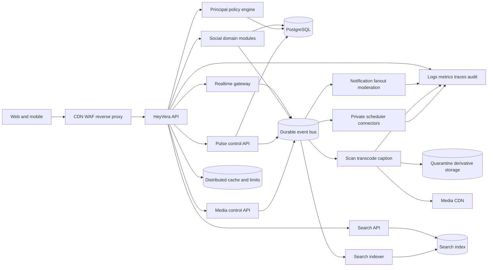

# HeyVera Socials — Production Readiness Audit and Master Plan

**Audit date:** 2026-07-28

**Audited revision:** `a7bb716e9a7612a9f80eb891be41324a10af59c6` (`origin/main`)

**Scope:** HeyVera Socials at `heyvera.org`, its Socials/Pulse frontend, Socials/Pulse Rust APIs, data, media, operations, tests, and repository practices

**Explicitly out of scope:** Soma, the separate Vera product, Cortex as a product, and unrelated monorepo products

**Purpose:** the durable, evidence-grounded list of what remains before HeyVera can credibly operate as a complete, secure, polished social platform

**Audience:** founder, product, design, engineering, trust and safety, security, operations, and future contributors

> This document is intentionally severe. A social network holds identities, relationships,
> private conversations, media, and high-risk user-generated content. “The page loads” is not
> production readiness. A feature is complete only when its product behavior, authorization,
> abuse controls, accessibility, failure handling, observability, tests, and operational runbook
> are complete together.

---

## 1. Executive verdict

HeyVera Socials is a **promising private-alpha foundation, not yet a production social
platform**. It contains real working primitives—Clerk-backed identity, profiles, posts, social
actions, drafts, a Pulse tool loop, communities, messages, settings, and deploy configuration—but
the current product is materially incomplete and several privacy, authorization, media, abuse,
reliability, and release-control gaps are launch blockers.

The live signed-out experience is sparse and recognizably patterned after X: a left navigation
rail, narrow central feed, right recommendation rail, compact text posts, and nearly identical
action placement. That does not satisfy the stated vision of a unique platform combining the best
community, relationship, real-time, and creator-video ideas without copying any one product.
Several live screens expose implementation limitations directly to users—for example, communities
that may not persist, native progressive video without a media pipeline, and “live” sessions
without ingest or playback. That is honest during development, but it also confirms the product is
not ready to be presented as complete.

### Brutal readiness scorecard

These scores reflect production readiness, not effort already invested.

| Area | Score | Assessment |
|---|---:|---|
| Product strategy and differentiation | 4/10 | Strong ambition and some useful concepts, but no fully expressed unique interaction model yet |
| Core posting and social graph | 5/10 | Basic flows exist; policy enforcement, scale, integrity, ranking, and edge cases are incomplete |
| Visual design and interaction polish | 4/10 | Coherent dark theme, but generic/X-like composition, sparse states, and inconsistent product depth |
| Profiles, identity, and Pages | 4/10 | Profile basics exist; public DTO, Page model, recovery, verification, and lifecycle need substantial work |
| Communities and group belonging | 2/10 | UI/API foundations only; permissions, persistence, moderation, roles, channels, and events are missing |
| Messaging and real-time presence | 4/10 | Durable inbox/history pagination, per-member receipts, retry idempotency, aggregate unread truth, and gap-aware local realtime recovery now exist; cross-instance delivery, attachments, presence, calls, and mature safety remain |
| Watch/video and creator platform | 2/10 | Raw native video only; no upload processing, adaptive streaming, captions, creator studio, or rights tooling |
| Live | 1/10 | Database lifecycle scaffolding without real ingest, playback, chat, recording, or moderation |
| Discovery and search | 2/10 | Empty or shallow discovery; no mature search index, recommendation system, topic model, or controls |
| Pulse marketing automation | 4/10 | Useful draft/tool foundation; approval boundary, scheduler isolation, campaigns, analytics, and connectors are incomplete |
| Trust, safety, and moderation | 2/10 | Block/mute/report primitives exist; platform-scale enforcement and case operations do not |
| Privacy and authorization | 2/10 | Preferences are stored but not consistently enforced on server reads/writes |
| Security | 3/10 | Some authentication and rate limiting exist; fail-open paths and trust-boundary gaps remain |
| Accessibility and inclusive design | 3/10 | No demonstrated WCAG 2.2 AA gate or comprehensive keyboard/screen-reader testing |
| Reliability, scale, and operations | 2/10 | Single synchronous SQLite connection, query amplification, limited observability, and risky deploy mechanics |
| Test and release confidence | 3/10 | Unit/type/build pass locally; browser suite and CI/release guarantees are inadequate |
| Repository and branch hygiene | 2/10 | Significant generated/archive debris, stale refs, documentation drift, and over-permissive automerge |
| **Overall production readiness** | **3/10** | **Do not market or operate as a finished public social platform yet** |

### What may be said honestly today

- HeyVera has an actively developed Socials prototype and private-alpha foundation.
- Users can exercise a subset of profile, posting, social, message, community, and Pulse flows.
- Watch, Live, rich communities, dependable real-time messaging, mature discovery, and autonomous
  marketing are not complete products.
- Any public beta must follow the launch gates in this document; an invite-only development alpha
  must still resolve the P0 security and privacy findings first.

---

## 2. Audit method and evidence

This audit used four evidence sources:

1. **Repository inspection:** live route tree, React components, API clients, Rust handlers,
   SQLite migrations/queries, authentication, rate limiting, media, Caddy, Docker/deploy files,
   workflows, tests, and tracked artifacts.
2. **Local verification:** clean dependency install, TypeScript, production build, Vitest,
   Playwright collection/execution, Rust test attempts, and dependency advisory review.
3. **Live product inspection:** signed-out production routes at `https://heyvera.org` on desktop,
   including Network, Discover, Watch, Live, Guilds, Pulse, Inbox, profiles, and settings.
4. **External production standards:** W3C, OWASP, NIST, Clerk, FTC, U.S. Copyright Office, European
   Commission, and UK ICO primary guidance listed in section 18.

### Verification results at the audited revision

| Check | Result | Meaning |
|---|---|---|
| `npm ci` | Pass | Lockfile installs reproducibly in the audit environment |
| `npm run typecheck` | Pass | Current TypeScript project compiles |
| `npm run build` | Pass | Vite production build succeeds |
| `npm run test:unit` | Pass: 35 files, 241 tests | Useful component/client coverage exists |
| `npm audit --omit=dev` | 4 production-tree advisories: 1 moderate, 3 high | Clerk/js-cookie and React Router paths require upgrade/triage |
| Playwright E2E | Not a reliable release signal | Specs use stale routes/selectors/mocks; 46 failure contexts appeared before the bounded run stopped |
| Rust tests | Environment-blocked locally | GNU lacked `-lgcc`; MSVC linker was absent. This does not show that Rust source tests fail |
| Live signed-out smoke | Pages load | Also exposed empty/incomplete states and X-like shell composition |

### Important audit limitations

- Production inspection was signed-out; Clerk flows, private messages, recovery, billing,
  moderation, and privileged operations were evaluated primarily from code.
- The connected GitHub API could not enumerate the private repository and the local `gh` token was
  invalid. Remote refs and the default branch were inspected through Git. PR state must be
  reconciled after authenticated GitHub access is restored.
- No production database, logs, dashboards, backups, object store, Clerk tenant, or secrets were
  accessed. Operational claims without repository evidence are unverified.
- This is not a penetration test or legal opinion. It identifies work that should precede
  specialist review.

---

## 3. Product principles for the intended platform

The goal should not be “Discord + Facebook + X + old YouTube in one navigation menu.” That would
produce a crowded clone. The unifying product idea should be:

> **A place where an identity can belong, converse, publish, and build an audience—while retaining
> clear control over context, reach, and automation.**

### Non-negotiable principles

- **Context before virality.** Every post has an understandable audience and destination.
- **Conversation before engagement extraction.** Optimize for meaningful replies, recurring groups,
  and creator-viewer relationships, not outrage or compulsive metrics.
- **One identity system, multiple public Pages.** A private account controls public Pages; never
  leak the underlying authentication-provider identifier.
- **Spaces are first-class.** A Guild has roles, rooms, resources, events, moderation, and memory.
- **Creators own a coherent channel.** Posts, video, live, playlists, community, memberships, and
  analytics belong to one Page.
- **Pulse is accountable augmentation.** It prepares, recommends, schedules, and measures. It does
  not silently expand authority or impersonate a person.
- **Reach is explainable.** Users can tell why they saw something and tune the system.
- **Private means technically private.** Every object path enforces the same policy server-side.
- **Youth safety is designed in.** Defaults, discovery, contact, reporting, and ranking account for
  younger users before launch.
- **No dead-stage theater.** Hide unavailable features or label a bounded beta.
- **Unique visual language.** Borrow proven behavior, not another platform’s composition, icons,
  terminology, or visual hierarchy.

### Behaviors worth learning from—without copying appearance

| Source category | Keep the useful lesson | Improve the failure mode |
|---|---|---|
| Real-time community platforms | Low-friction rooms, roles, presence, voice, shared rituals | Avoid maze-like navigation, moderator overload, and unsafe unsolicited contact |
| Relationship networks | Durable identity, events, groups, albums, life-context sharing | Avoid opaque reach suppression, data overcollection, clutter, and deceptive notifications |
| Public conversation networks | Fast publishing, topical discovery, quote/reply graph, live events | Reduce harassment amplification, context collapse, bot spam, rage ranking, and metric obsession |
| Classic creator video | Human-scale channels, subscriptions, comments, series/playlists | Improve copyright, safety, discovery, accessibility, and creator control |

---

## 4. Current product truth matrix

“Present” means a route or primitive exists. It does not imply production completeness.

| Surface | Present now | Material gap before “complete” |
|---|---|---|
| Network/Home | Feed, compose, social actions, suggestions | Policy, cursor rigor, private-audience enforcement, ranking, quality, resilient loading, unique layout |
| Discover | Route and trend/search shell | Search index, topics, trends, safety, geography/language, explanations, useful populated states |
| Post/thread | Post route, replies, actions | Viewer-aware reads, deep conversation, pagination, moderation context, private/deleted ancestors |
| Profiles | Public profile and actions | Page/account separation, privacy, tabs, Channel organization, verification, safety, SEO/share polish |
| Notifications | Notification primitives | Deduplication, controls, aggregation, push/email, cursors, abuse-safe generation |
| Inbox | Transactional conversations, confidential activity-keyset inbox/history pages, explicit per-member reads, retry-safe sends, aggregate unread truth, and durable local reconnect recovery | Cross-instance pub/sub/shared storage, attachments, reactions, edit/delete, requests, search, calls, safety |
| Guilds | Browse/create/join concepts | Durable membership, roles, permissions, rooms, kick/ban, audit, events, resources, moderation |
| Watch | Video shelves and native playback shell | Trusted upload, processing, thumbnails, adaptive streaming, captions, Channels, playlists, rights |
| Live | Session lifecycle labels | Ingest, transcode, playback, chat, moderation, recording, scheduling, notifications |
| Bookmarks | Basic saved-post behavior | Collections, notes/tags, search, privacy, deleted-content behavior |
| Settings | Extensive UI and stored preferences | Server enforcement, sessions, export/deletion, notification matrix, accessibility, auditability |
| Premium | Marketing surface | Packaging, entitlements, billing truth, refunds/tax, receipt state, support, value |
| Pulse | Tool/draft flow, schedules, goals | Approval boundary, tenant jobs, campaigns, Brand Kit, analytics, listening, teams, connectors |

### Live experience observations

- Desktop Home strongly resembles the conventional X three-column pattern.
- Signed-out compose is visible although publishing requires identity, creating an unclear contract.
- The right rail has Premium, empty trends, and follows but not distinctive discovery.
- Communities says membership may not persist and kick/ban is unavailable.
- Watch says it has progressive video but no adaptive stream/transcode pipeline.
- Live says media ingest/playback and integrated comments are absent.
- Sparse screens feel like engineering demonstrations rather than finished destinations.
- Terms, Privacy, and About link to broad settings instead of dedicated public destinations.

---

## 5. P0 launch blockers

Resolve these before an open beta. Security/privacy items also apply to an invite-only alpha.

### P0-01 — Make authentication and account status fail closed

**Evidence**

- `CORTEX_AUTH_DISABLED` can select local identity behavior in the HeyVera server path.
- The server can start without complete Clerk configuration and log that Clerk auth is disabled.
- JWT issuer and authorized-party validation are not both mandatory.
- WebSocket authentication now exchanges the Clerk bearer token over authenticated HTTP for a
  30-second, hashed, one-use ticket and validates the production browser origin.
- Account-status rejection is not consistent across authentication paths.

**Required work**

- [ ] Separate development authentication from production binary/configuration.
- [ ] Refuse production startup unless Clerk issuer/JWKS/audience or authorized parties are valid.
- [ ] Validate signature, issuer, expiration, not-before, audience/authorized party, and token type.
- [ ] Use one principal extractor for HTTP, WebSocket, scheduler, agent, and moderator paths that
      rejects suspended, deleted, locked, and age-restricted status.
- [x] Replace WebSocket JWT query tokens with short-lived, hashed, atomically consumed one-time
  tickets and enforce the configured production origin during the handshake.
- [ ] Scrub auth material from application, proxy, analytics, and error logs.
- [ ] Test missing, forged, expired, wrong-tenant, and status-changed tokens.
- [ ] Prove production boot rejects all fail-open flags.

**Exit evidence:** boot matrix passes; anonymous/suspended principals cannot reach protected paths.

### P0-02 — Centralize and enforce audience/privacy authorization

**Evidence**

- `protected_posts`, `profile_visibility`, DM/mention, and agent-contact settings are not
  consistently enforced.
- Direct post-by-ID and thread paths can bypass feed audience filtering.
- Community posting does not consistently prove active membership/permission.
- Blocks are not a universal barrier across direct reads/interactions.

**Required work**

- [x] Define typed public/followers/mutuals/guild/circle/author-only visibility; reject arbitrary
      strings.
- [ ] Build one policy service for every post/profile/thread/search/embed/media read and every
      reply/mention/repost/quote/message write.
- [ ] Make block a platform-wide bidirectional interaction barrier with explicit safety/legal
      exceptions only.
- [ ] Keep mute viewer-local and distinct from authorization.
- [ ] Enforce protected Page/profile state in search, notifications, quote previews, media, caches,
      and embeds.
- [ ] Require guild membership and role permission for every guild operation.
- [ ] Add table-driven anonymous/self/follower/non-follower/blocked/muted/member/moderator/
      suspended/deleted tests.
- [ ] Prevent counts/error shapes from revealing private existence.

**Exit evidence:** every object/action passes one policy suite; no direct-ID bypass exists.

**Implementation progress — 2026-07-31 (`security/socials-authorization-policy`)**

- Added `social_policy.rs` with canonical post audiences, profile visibility, conceal/allow
  decisions, and table-driven matrices. Unknown persisted values fail closed; `private` is migrated
  to `author-only`.
- Added transactional schemas v54–v55: reply audience ownership, canonical post/longform/Pulse
  audience repair, validation triggers, and approval-based protected follow requests. Both new
  migrations re-read the version under an immediate lock; v54 and v55 fixture/re-entry tests pass.
- Centralized post authorization now gates direct post reads, complete thread output, feed/search/
  bookmark/profile-feed enrichment, related-source reads, nested quote previews, like, bookmark,
  repost, reply, quote, protected posts, bidirectional blocks, and Guild membership.
- Replies inherit the parent audience owner, audience, and Guild. This prevents a reply author from
  accidentally making a protected thread public to their own followers.
- Centralized profile authorization now gates direct profiles, discovery/search/list/featured,
  stats, follower/following lists, linked-agent lists, live-session discovery, and blocks. Public
  DTOs recursively remove Clerk account IDs and agent key material.
- Notification reads revalidate actor and post access. DM creation now validates/deduplicates
  participants, enforces the canonical `everyone`/`verified`/`following`/`mutuals`/`nobody`
  policies for new threads, keeps existing authorized threads reopenable after policy tightening,
  and applies bidirectional blocks to conversation list/read/send and WebSocket subscribe paths.
- DM schema v56 adds deterministic per-conversation sequence numbers, durable direct-thread and
  group-create idempotency keys, conservative duplicate-thread migration, and monotonic
  per-participant read watermarks. Message history uses encrypted, randomized, viewer- and
  conversation-bound keyset cursors; GET is non-mutating; sends are content-bounded and retry-safe.
- DM schema v57 adds a durable monotonic conversation activity clock so mixed legacy timestamp
  formats cannot corrupt inbox ordering. Conversation authorization is filtered before the SQL
  limit, and randomized encrypted inbox cursors are viewer-bound. Concealed single-conversation
  hydration supports deep links; uncapped unread aggregation keeps navigation badges truthful.
- DM schema v58 repairs unknown legacy consent values to fail-closed `nobody`, constrains persisted
  values to the five canonical policies, and adds mutual-follow and nobody enforcement. The settings
  copy describes conversation-start consent without implying a request inbox that is not built yet.
- DM authorization is rechecked inside create/send/read transactions and again for each local
  WebSocket delivery. Frames, subscriptions, identifiers, participant cardinality, and route bodies
  are bounded; sensitive JSON responses are `private, no-store`. A saturated consumer receives
  exactly one explicit gap signal and the socket closes for a fresh authenticated subscription.
- The live inbox merges paged/polled/WebSocket/send results by durable ID and sequence, retains older
  pages, waits for the subscription acknowledgement, catches up through a forward-only encrypted
  cursor before claiming `Live`, unsubscribes old threads, acknowledges reads only while visible,
  keeps one client message ID across retries, and renders participant-specific receipt metadata.
- A three-principal handler test proves participant inbox/unread truth and concealed outsider detail/list
  behavior. A real Clerk-backed browser principal matrix remains required.
- Protected profiles now use an explicit pending/approve/reject/cancel follow workflow. Retries are
  idempotent, approval is atomic, blocks revoke the relationship in both directions, and status
  changes immediately revoke protected post/media access. Notifications and live UI cover the
  request and acceptance states without falsely presenting a pending request as a follow.
- Every Guild feed, post, direct-post read, and member-list operation now requires membership;
  inaccessible resources use concealed `404` responses on the new boundary.
- Non-public media is delivered through a five-minute HMAC capability bound to media, post, viewer,
  and expiry. Delivery revalidates attachment and current post/profile/account policy, never exposes
  the storage key, and uses a 60-second storage GET. The anonymous mock GET was removed.
- Authorization-aware scanners fill feed and connection pages across concealed rows. Post cursors
  derive from the last visible row; connection offsets are AES-256-GCM encrypted, randomized,
  domain-separated, and tamper-evident. Profile discovery/search still lacks an independent cursor.
- Viewer-sensitive frontend reads now attach optional auth for direct posts, related posts, profile
  stats, relationship lists, and search.
- Verification at this checkpoint: 269/269 frontend unit tests plus frontend typecheck/production
  build pass. The focused DM migration/dedupe/inbox/history/read/idempotency/content/cursor/gap tests
  pass, and the backend library compiles. The full backend library run is 258/259; its only failure is the
  pre-existing Windows-only `validate::tests::normalizes_dot_segments` slash expectation. The prior
  broader Socials integration checkpoint remains 15/15.

This P0 remains open. Circle storage/management, moderator/role granularity, policy-aware SQL/batching,
independent profile-search pagination, cross-instance DM pub/sub/shared storage, privacy-safe
aggregate counts/caches/embeds outside messaging, and real authenticated multi-principal route/E2E
required before the exit evidence
is true. Signed media URLs are deliberately short-lived bearer capabilities; stronger session/device
binding would require cookie-authenticated media proxying or a different delivery architecture.

### P0-03 — Replace fragile data access and migrations

**Evidence**

- One synchronous `rusqlite::Connection` is mutex-wrapped behind async handlers.
- Feed/thread/conversation hydration issues dependent queries per item.
- Schema version declarations and migration bodies have drifted inside a large database file.
- Constraints/cascades are incomplete and production paths include `expect`/`unwrap`.

**Required work**

- [ ] Use PostgreSQL with pooled async access for production; retain SQLite only for local/tests if
      useful.
- [ ] Add immutable, transactional, checksummed migrations and recovery procedure.
- [ ] Add foreign keys, uniqueness, checks, indexes, and explicit deletion behavior.
- [ ] Remove user-triggerable panic paths; return typed errors with trace IDs.
- [ ] Replace N+1 hydration with bounded joins/batches and cursor queries.
- [ ] Add idempotency for remaining reactions, notifications, uploads, schedules, and moderation;
      follows and messages now have durable retry semantics.
- [ ] Define retention, tombstones, export, deletion, legal hold, and backup semantics.
- [ ] Load-test feed, thread, profile, message, notification, and search at realistic graph size.

**Exit evidence:** migration restore/upgrade and load tests pass without global serialization.

### P0-04 — Make media an untrusted processing pipeline

**Evidence**

- Upload completion largely trusts client-claimed MIME/size and object existence.
- No demonstrated magic-byte validation, checksum, malware scan, decompression-bomb control,
  dimensions/duration/codec limits, or moderation queue exists.
- Raw video is progressive and restricted delivery is not strongly audience-bound.

**Required work**

- [ ] Use short-lived upload grants bound to owner, object key, maximum bytes, and purpose.
- [ ] Verify actual bytes, signature, checksum, dimensions, duration, codecs, and container.
- [ ] Quarantine every upload pending malware, safety, and technical validation.
- [ ] Strip unsafe metadata and serve generated safe derivatives by default.
- [ ] Build image variants and adaptive video, posters, previews, waveform, captions, manifests.
- [x] Deliver non-public media through short-lived policy-bound authorization.
- [ ] Clean abandoned, rejected, deleted, and failed assets.
- [ ] Add abuse/copyright matching hooks and evidence-preserving takedown workflow.

**Exit evidence:** hostile files remain quarantined; private URLs expire on policy/state change.

### P0-05 — Rebuild rate limits and abuse defenses around verified principals

**Evidence**

- Limits are in-memory and per process.
- An unverified token subject may influence rate-limit identity.
- Anonymous traffic can collapse into one shared bucket.
- Proxy-header trust and a public server bind create source-identity ambiguity.

**Required work**

- [ ] Derive authenticated keys only after token verification.
- [ ] Use a distributed atomic limiter with IP/prefix, account, Page, device/session, action,
      target, and global safety layers.
- [ ] Define trusted proxy hops and bind the app to loopback/private network by default.
- [ ] Add action-specific quotas/friction for signup, follow, invite, DM, mention, report, upload,
      search, reaction, and Pulse.
- [ ] Add spam, credential-stuffing, scraping, enumeration, brigading, and sybil signals.
- [ ] Keep challenges accessible and appealable.
- [ ] Build feature kill switches and degradation controls.

**Exit evidence:** multi-instance quotas hold; spoofed headers/unverified JWTs cannot select a
victim’s bucket.

### P0-06 — Restore a real human-approval boundary in Pulse

**Evidence**

- The model tool path can emit sequential approval and publishing tools in one response.
- An authenticated request can process a global due-schedule queue and receive published IDs.
- `publish_at` is effectively arbitrary string data in scheduling comparisons.
- Scheduling relies on external cron using a user bearer token.

**Required work**

- [ ] Separate draft, review, approval, schedule, and publish state transitions with actor, tenant,
      version, time, and immutable audit event.
- [ ] Never let an LLM approve its own content or widen its authority.
- [ ] Require explicit human approval unless a narrow, revocable, expiring automation policy is
      configured through a dedicated risk flow.
- [ ] Run jobs only from a private worker identity; remove the global user-triggerable scheduler.
- [ ] Partition every query/job/result by account and Page.
- [ ] Parse typed UTC timestamps; retain original timezone/DST intent and define missed/retry/cancel.
- [ ] Lock/idempotently retry so public content cannot duplicate.
- [ ] Defend against prompt injection; allowlist tools; validate schemas/policy; log model/vendor.
- [ ] Show queue, diff, approver, reason, provenance, error, retry, and rollback state.

**Exit evidence:** neither a model nor normal user can self-approve, cross tenants, or double-publish.

### P0-07 — Make CI and deployment trustworthy

**Evidence**

- HeyVera CI emphasizes typecheck/build and does not enforce the full unit, browser,
  accessibility, security, and Rust integration suite.
- Automerge is broadly armed for non-draft PRs and depends on incomplete gates.
- Production deploy may use an arbitrary branch and forceful mirror/reset mechanics.
- A health check uses port `3001` while Socials/Pulse is on `heyvera-server` port `3002`.
- Frontend deployment can continue when Caddy reload is unavailable.

**Required work**

- [ ] Require format, lint, type, unit, Rust integration, migration, contract, E2E smoke,
      accessibility, dependency, secret, and static-security checks.
- [ ] Rebuild Playwright against the live router and deliberate test backend.
- [ ] Restrict automerge to explicitly labeled/approved PRs after every required check/owner review.
- [ ] Deploy immutable artifacts built once from reviewed protected `main`.
- [ ] Eliminate production force-push/reset deployment flows.
- [ ] Use environment protection, least-privilege deploy identity, approval, and audited rollback.
- [ ] Verify the actual Socials/Pulse health/readiness endpoint and dependencies.
- [ ] Fail when proxy validation/reload or smoke tests fail.
- [ ] Add canary/blue-green behavior and automated rollback for SLO regression.

**Exit evidence:** broken auth, migration, accessibility, and E2E changes cannot merge/deploy.

### P0-08 — Establish real trust-and-safety operations

**Evidence**

- Block, mute, and report exist, but target validation, evidence, duplicate control, case lifecycle,
  appeals, and enforcement operations are immature.
- Some failures are returned inside successful HTTP responses, weakening automation and alerts.

**Required work**

- [ ] Publish conduct, child safety, impersonation, harassment, sexual content, violence, self-harm,
      hate, spam, fraud, and manipulated-media policies.
- [ ] Create structured reasons, evidence snapshots, reporter safety, dedupe, priority, and status.
- [ ] Build least-privilege moderator roles, queues, notes, four-eyes sensitive actions, immutable
      audit, and quality review.
- [ ] Add active, limited, age-restricted, quarantined, removed, appealed, restored, preserved, and
      deleted content states.
- [ ] Add scoped/duration-bound account and Page actions with reason, notice, appeal, restoration.
- [ ] Add proactive spam/bot/fraud/CSAM risk pipelines with human escalation.
- [ ] Define emergency, imminent-harm, law-enforcement, and child-safety procedures.
- [ ] Build transparency metrics and moderator wellness/access controls.

**Exit evidence:** report drills prove evidence, timely action, notices, appeals, and restricted
access.

### P0-09 — Prove observability, backup, and recovery

- [ ] Define indicators for availability, latency, errors, media, notifications, messages,
      scheduler delay, and moderation response.
- [ ] Set beta SLOs and error-budget policy.
- [ ] Emit structured privacy-safe logs with request/trace IDs.
- [ ] Add metrics, traces, queue depth/age, dependency health, and deploy markers.
- [ ] Add alert ownership, severity, runbooks, escalation, and postmortems.
- [ ] Encrypt/automate database and object metadata backups; define RPO/RTO.
- [ ] Test full/PITR restore, host loss, corrupt migration, object/Clerk/model outage.
- [ ] Define degraded read-only operation and public incident communication.

**Exit evidence:** a timed game-day restore meets RPO/RTO with actionable alerts.

### P0-10 — Remove product theater and misleading states

- [ ] Hide/gate Live until ingest/playback/chat works end to end.
- [ ] Do not call raw upload/playback a complete Watch product.
- [ ] Do not claim guild/message/schedule/billing/preference persistence without verified truth.
- [ ] Give every empty state a useful explanation and safe next action.
- [ ] Use an explicit Labs contract where incomplete exposure is useful.
- [ ] Add dedicated versioned Terms, Privacy, Guidelines, Copyright, Safety, and About pages.
- [ ] Design signed-out surfaces intentionally; do not expose apparently working controls that fail.

### P0-11 — Meet an accessibility release gate

- [ ] Adopt WCAG 2.2 AA minimum.
- [ ] Make navigation, dialogs, compose, menus, media, drag/drop, and moderation keyboard operable.
- [ ] Add focus, order, skip links, landmarks, headings, names, roles, descriptions, and linked errors.
- [ ] Test screen readers on Windows, macOS/iOS, and Android.
- [ ] Support zoom/reflow, spacing, target size, reduced motion, high contrast, captions,
      transcripts, audio-description strategy, and no color-only meaning.
- [ ] Add automated plus manual accessibility release checks.

### P0-12 — Close application and supply-chain security gaps

- [ ] Add tested nonce/hash Content Security Policy without unnecessary wildcards.
- [ ] Add HSTS when ready, Permissions-Policy, Referrer-Policy, frame-ancestors, MIME protection,
      and secure cookies.
- [ ] Resolve or formally accept production advisories; define upgrade/advisory SLAs.
- [ ] Add secret scan, dependency review, SBOM/provenance, pinned Actions, artifact signing, SAST,
      and container scanning.
- [ ] Threat-model auth, authorization, upload, messaging, Pulse, moderation, billing, ranking, admin.
- [ ] Run independent penetration test before open beta and retest fixes.

---

## 6. Distinctive product and experience direction

### Proposed core objects

| Object | Purpose |
|---|---|
| Account | Private login, sessions, safety, billing, ownership; never the rendered public actor |
| Page | Public person, creator, agent, brand, or organization controlled by account/team |
| Signal | Short/medium post, media update, poll, link, or announcement |
| Thread | Conversation graph around a Signal with a focused reading mode |
| Guild | Durable community with membership, governance, rooms, events, resources |
| Room | Scoped real-time or asynchronous context inside a Guild |
| Channel | A Page’s publishing home across Signals, video, live, playlists, community |
| Circle | Private reusable audience selected by a Page |
| Broadcast | Scheduled/live event with ingest, chat, moderation, recording, replay |
| Collection | User-curated saved posts, videos, resources, or playlists |
| Campaign | Pulse objective with drafts, schedule, approval policy, measurement |

Names are working vocabulary. Validate whether “Signal,” “Guild,” “Room,” and “Broadcast” feel
natural and ownable.

### Proposed unique desktop composition

Avoid another fixed three-column timeline. Use a **context canvas**:

- A compact global **orbit bar** holds Page switcher, universal search/command, create, inbox, and
  safety status.
- A left **context rail** changes by destination: followed Pages, Guild rooms, Watch subscriptions,
  or Pulse campaign queue.
- The center **canvas** changes density for conversation, creator Channel, room, video theater, or
  campaign workspace.
- A collapsible **context drawer** shows why an item is here, participants, related media,
  moderation, transcript, or campaign metadata—not permanent generic trends.
- Mobile uses an adaptive five-item dock and Page/action switcher; desktop rails are not squeezed
  into a small screen.

### Signature interactions worth prototyping

- **Context lens:** reveal audience, source room/Channel, reply topology, and “why you saw this.”
- **Quiet mode:** temporarily prioritize followed people/Guilds chronologically and suppress
  recommendations/metrics.
- **Thread map:** visual branch navigator plus accessible linear reading mode.
- **Creator desk:** publish, uploads, live, playlists, comments, membership, analytics, and Pulse.
- **Guild pulse:** permission-safe recap editable by moderators before sending.
- **Intentional share:** preview who can see, reply, quote, download, or invite before publishing.
- **Healthy metrics:** useful creator/conversation signals without universal public scoreboards.

### Design-system requirements

- [ ] Establish brand attributes and visual principles before a reskin.
- [ ] Build semantic color/type/space/radius/elevation/motion/density/data tokens.
- [ ] Document accessible component states: default, hover, focus, active, disabled, loading,
      error, empty, offline, restricted, destructive.
- [ ] Define media ratios, Page marks, thumbnails, badges, roles, and warning treatments.
- [ ] Use deliberate conversation, editorial, data, and control type scales.
- [ ] Replace `src/index.css` (roughly 6,600 lines) with layered tokens/primitives/components/layouts.
- [ ] Break very large pages into domain modules and view models.
- [ ] Maintain Storybook or equivalent visual/interaction/accessibility harness.
- [ ] Add visual regression across devices, themes, zoom, and reduced motion.
- [ ] Review originality against major platforms before signoff.
- [ ] Test with creators, moderators, viewers, and accessibility participants.

---

## 7. Complete product backlog by domain

Items should become epics with owner, acceptance criteria, risk, dependency, metric, rollout plan,
and test plan.

### 7.1 Account, identity, Pages, and lifecycle

- [ ] Make private Account versus public Page explicit in schema, API, and UI.
- [ ] Remove Clerk IDs from public DTOs; expose opaque HeyVera Page IDs only.
- [ ] Support person, creator, agent, brand, and organization Page types with policy differences.
- [ ] Support Page creation, handle change, transfer, team ownership, roles, and recovery.
- [ ] Add handle reservation, confusable detection, protected names, impersonation review, and
      audited history/redirects.
- [ ] Define display name, pronoun, bio, links, location, birthday, category, and contact privacy.
- [ ] Keep verified email/phone posture private.
- [ ] Define verification categories/evidence; do not sell an ambiguous identity checkmark.
- [ ] Add device/session inventory, revoke-all, suspicious-login alert, and step-up authentication.
- [ ] Add compromised-account, lost-device, deceased-user, memorial, and ownership-dispute flows.
- [ ] Support data export, deactivation, deletion grace, cancellation, and documented cascades.
- [ ] Add team Page roles with least privilege and sensitive-action approvals.
- [ ] Show “acting as” everywhere a user publishes, messages, moderates, or pays.
- [ ] Add authorized Page activity/audit history.
- [ ] Define agent disclosure, owner attribution, scopes, key rotation, and revocation.

### 7.2 Composer and publishing

- [ ] Build one composable editor for Signal, reply, quote, Guild post, video post, and Pulse draft.
- [ ] Autosave versioned drafts safely across devices.
- [ ] Add audience, reply, quote, download, remix, mention, and discovery controls.
- [ ] Add media reorder, alt text, crop/focal point, captions, warning, thumbnail, processing state.
- [ ] Fetch link previews with SSRF defense, sanitization, caching, opt-out, and correction.
- [ ] Add typed polls with duration, vote privacy, result timing, and integrity.
- [ ] Decide edit policy and transparent history without leaking redacted/private data.
- [ ] Add delete/undo and define quote/reply/cache aftermath.
- [ ] Add native scheduling; Pulse supplies workflow/strategy above it.
- [ ] Add idempotency and offline retry.
- [ ] Count Unicode graphemes/bytes correctly with accessible counters.
- [ ] Add language choice/detection, translation control, and RTL readiness.
- [ ] Make policy interventions specific/appealable and preserve safe drafts when denied.

### 7.3 Feed, following, and recommendations

- [ ] Offer clear Following, For You, Guilds, and custom-view modes.
- [ ] Make Following reliably chronological with explicit pinned/repost behavior.
- [ ] Define candidate sources, filters, ranking objectives, freshness, diversity, and safety.
- [ ] Add “why you saw this,” tuning, topic controls, snooze, and reset.
- [ ] Prevent blocked/private/deleted/limited leakage in candidates and hydration.
- [ ] Separate viewable impressions from HTTP reads; deduplicate and detect fraud.
- [ ] Use stable opaque cursors without repeats/skips under concurrent posts.
- [ ] Prevent one Page/topic from dominating.
- [ ] Limit repost loops, engagement bait, coordinated spam, and new-account abuse.
- [ ] Build cold start from explicit interests and trusted subscriptions.
- [ ] Run controlled experiments with guardrails, allocation logs, and stop conditions.
- [ ] Audit ranking across language, geography, age, creator size, and safety.

### 7.4 Threads, replies, and conversation quality

- [ ] Model reply ancestry/root with indexed integrity constraints.
- [ ] Support deep threads without loading hundreds or per-reply queries.
- [ ] Add relevant/newest/oldest/Page/moderator-pinned sorting.
- [ ] Preserve context when parents are deleted, private, blocked, or limited.
- [ ] Add author reply audience, hide, mute, lock, and approved-participant controls.
- [ ] Distinguish platform removal from author curation with clear notices.
- [ ] Add quote context, correction/context option, and anti-dogpile friction.
- [ ] Preserve drafts/reading position in large threads.
- [ ] Make screen-reader linearization and keyboard navigation first-class.
- [ ] Test fan-out, viral threads, celebrity blocks, and mass deletion.

### 7.5 Search, topics, and discovery

- [ ] Select a real search index and change-data-capture strategy.
- [ ] Index only policy-authorized fields; tombstone within a defined SLA.
- [ ] Search Pages, posts, videos, Guilds, rooms, Broadcasts, topics, and help/policy.
- [ ] Add safe parsing, typo tolerance, language, filters, date/media scope, and cursors.
- [ ] Protect private profiles, Guilds, messages, Circles, drafts, and block relationships.
- [ ] Compute trends from abuse-resistant time-bounded signals rather than raw volume.
- [ ] Add geography/language, explanations, safety review, and manipulation detection.
- [ ] Add sensitive-topic and age-appropriate discovery controls.
- [ ] Build explained, diverse creator/Guild recommendations.
- [ ] Add saved search/alerts only with anti-stalking controls.
- [ ] Measure successful discovery, satisfaction, hides/blocks, and harmful exposure.

### 7.6 Profiles and creator Channels

- [ ] Design a distinctive Channel home instead of a generic microblog profile.
- [ ] Add overview, Signals, videos, live/replays, playlists, Guilds, about, and membership sections.
- [ ] Let owners curate a trailer, featured series, pinned items, and newcomer path.
- [ ] Use consistent Follow/Subscribe semantics or explain the difference.
- [ ] Add safe message/contact, mutual/shared-Guild context, report, and block.
- [ ] Add structured links/business contact with phishing defense.
- [ ] Preview how each audience class sees the Page.
- [ ] Generate SEO/social metadata only for truly public/indexable content.
- [ ] Give creator analytics definitions, delay/finality, bot filtering, and export.
- [ ] Make public metric visibility configurable.

### 7.7 Guilds, rooms, roles, and events

- [ ] Define public, discoverable, request, invite-only, hidden, and paid Guild types.
- [ ] Make create/join/leave/invite/request/approve transactionally durable.
- [ ] Add owner/admin/moderator/member/guest and custom permissions.
- [ ] Enforce every room/content/member/moderation permission on the server.
- [ ] Build text, announcement, forum/topic, media, event, stage, and voice room types deliberately.
- [ ] Add room categories, onboarding questions, rules acceptance, and starter roles.
- [ ] Add privacy-aware member directory with agent/bot disclosure.
- [ ] Add kick, timeout, ban, invite revoke, slow mode, approval, filters, and appeal.
- [ ] Add immutable Guild audit with actor, before/after, reason, export.
- [ ] Add timezone-aware recurring events, RSVP, reminders, capacity, hosts, replay.
- [ ] Add versioned permission-aware resources/wiki/bookmarks.
- [ ] Add anti-raid mode, verification levels, and emergency lockdown.
- [ ] Add ownership transfer and orphan-owner recovery.
- [ ] Add discovery quality, spam defense, and age/content classification.
- [ ] Define retention/export/deletion when a Guild dissolves.
- [ ] Use humane notification defaults.

### 7.8 Messaging, presence, voice, and calls

- [x] Validate/deduplicate participants; enforce existence and group maximum.
- [x] Replace one global read bit with per-participant delivery/read cursors.
- [x] Use newest/cursor pagination; do not return only the oldest page.
- [ ] Add request inbox, spam filtering, shared context, accept, and decline.
- [ ] Correctly enforce everyone/following/mutuals/nobody/custom DM policy.
- [ ] Add limits, reply, reaction, edit history, delete, pin, search, and link safety.
- [ ] Send attachments through the trusted media pipeline.
- [ ] Add typing, presence/last-seen privacy, delivery, and reconnect semantics.
- [ ] Add group roles, participant operations, identity, invitation permissions, and audit.
- [ ] Decide encryption honestly; never imply E2E without keys/recovery/reporting architecture.
- [ ] Build WebSocket/SSE scale, backpressure, ordering, missed replay, and presence fan-out.
- [ ] Add mute, archive, notification levels, block, and context-preserving report.
- [ ] Add calls only after signaling, TURN, quality, safety, consent, and cost design.
- [ ] Define content and metadata retention/lawful access separately.

### 7.9 Notifications

- [ ] Define canonical event types and dedupe keys.
- [ ] Aggregate noisy reactions/follows without hiding replies or safety events.
- [ ] Add stable cursors and per-user read state.
- [ ] Respect blocks, audience, deletion, and preferences during creation/rendering.
- [ ] Add in-app/push/email matrices, digest, quiet hours, and timezone.
- [ ] Build device-token lifecycle, bounce/unsubscribe, and delivery telemetry.
- [ ] Prevent mention/reply/invite spam and coordinated harassment.
- [ ] Make official safety/account/billing notices unspoofable.
- [ ] Handle deleted/private destinations safely.

### 7.10 Watch, upload, playback, and creator studio

- [ ] Design resumable multipart upload with progress, pause/resume, checksum, and recovery.
- [ ] Show processing states and actionable creator errors/retry.
- [ ] Generate adaptive HLS/DASH, thumbnails, storyboard, preview, waveform, and posters.
- [ ] Store masters safely; separate derivatives from authorization policy.
- [ ] Build an accessible player with captions, transcript, speed, quality, picture-in-picture,
      casting decision, keyboard support, and reduced-motion behavior.
- [ ] Add title/description/topic/language/category/audience/age/license/chapters metadata.
- [ ] Add subtitle upload/editor, automatic-caption labeling, corrections, and languages.
- [ ] Add playlists/series, queue, history, watch later, progress sync, and history deletion.
- [ ] Add Channel subscriptions with deliberate notification levels.
- [ ] Use the shared conversation system with creator moderation for comments.
- [ ] Build creator studio for library, processing, metadata, thumbnail, rights, comments,
      analytics, scheduling, and visibility.
- [ ] Add fingerprinting, notices/counter-notices, strikes, and repeat-infringer policy.
- [ ] Add safety review, age gate, sensitive thumbnails, autoplay, and youth product decision.
- [ ] Add storage/bandwidth budgets, CDN, invalidation, egress telemetry, and abuse limits.
- [ ] Define valid views/watch time and fraud-resistant analytics.
- [ ] Add privacy, CSP, domain, and owner controls to embeds.
- [ ] Preserve classic creator-Channel warmth without reproducing legacy visual design.

### 7.11 Live/Broadcast

- [ ] Choose build/vendor/hybrid strategy and RTMP/SRT/WebRTC ingest support.
- [ ] Build authenticated stream keys, rotation, test mode, and leak revocation.
- [ ] Add transcoding ladder, low-latency playback, captions, health metrics, and CDN.
- [ ] Add scheduled event page, reminders, countdown, production roles, and privacy.
- [ ] Integrate moderated chat with slow/follower/subscriber mode and filters.
- [ ] Add backstage, reconnect slate, stream health, latency, and incident controls.
- [ ] Record to VOD with trim/editor, chat replay choice, captions, and rights processing.
- [ ] Add raids/redirects/shared viewing only with anti-abuse safeguards.
- [ ] Add permissioned, attributable, removable clips.
- [ ] Define viewer targets, cost caps, graceful degradation, and load tests.
- [ ] Keep Live gated until an end-to-end private rehearsal passes.

### 7.12 Bookmarks and Collections

- [ ] Guarantee bookmarks are private by default and absent from public counts.
- [ ] Add named Collections, ordering, notes/tags, search, and optional sharing.
- [ ] Define deleted/private/blocked behavior without leaking continued access.
- [ ] Add import/export and appropriate offline metadata.

### 7.13 Moderation, safety, and user control

- [ ] Apply block/mute/restrict consistently across all surfaces.
- [ ] Add keyword/topic mute with duration and scope.
- [ ] Add content warning, sensitive-media blur, flashing warning, and autoplay controls.
- [ ] Optimize reports for immediate safety and minimal repeated exposure.
- [ ] Delegate Page/Guild moderation without sharing account credentials.
- [ ] Design community context against brigading, bad sourcing, conflicts, and failed appeals.
- [ ] Detect coordinated inauthentic behavior and disclose agents/automation.
- [ ] Add anti-doxxing and rapid private-information removal.
- [ ] Add non-consensual intimate imagery response and appropriate hash-sharing operations.
- [ ] Establish CSAM escalation with specialists and strictly limited employee access.
- [ ] Add non-punitive self-harm support/escalation UX.
- [ ] Add civic-integrity policy before relevant geographic scale.
- [ ] Measure moderator error/bias, appeal outcomes, and transparency.

### 7.14 Privacy, youth, legal, and governance

- [ ] Map data flows for auth, graph, messages, media, Pulse, analytics, moderation, billing, logs,
      vendors, and backups.
- [ ] Establish purpose, retention, access, deletion, and legal basis/notice per data class.
- [ ] Minimize data; avoid precise location/contact graphs without justified explicit need.
- [ ] Publish versioned Terms, Privacy, Guidelines, Copyright, Cookie, Law-Enforcement, and
      transparency policies.
- [ ] Record consent/version and provide age-appropriate explanations.
- [ ] Decide minimum age, age assurance, parental consent, teen defaults, and launch countries.
- [ ] Use protective youth discovery/contact/location/ad/recommender defaults.
- [ ] Complete COPPA and applicable regional child/youth risk assessment.
- [ ] Design EU DSA notice/action, reasons, complaint, transparency, recommender, and ad duties.
- [ ] Operate DMCA agent, takedown/counter-notice, evidence, and repeat-infringer process.
- [ ] Prepare for applicable non-consensual imagery removal deadlines, including U.S. TAKE IT DOWN
      Act duties, before broad public uploads.
- [ ] Build privacy-request verification, access/correct/delete/export, appeal, and SLA tracking.
- [ ] Review subprocessors, terms, transfers, incident notice, and deletion guarantees.
- [ ] Create minimized, audited lawful-request procedures.
- [ ] Govern algorithms, experiments, safety review, and model/provider changes.
- [ ] Obtain specialist legal review; this checklist is not legal advice.

### 7.15 Accessibility, localization, and inclusive use

- [ ] Assign accessibility ownership, conformance target, backlog, and public contact.
- [ ] Test core tasks keyboard-only, screen reader, 200–400% zoom, high contrast, reduced motion.
- [ ] Support alt text and decorative-image declaration.
- [ ] Require platform captions/transcripts and easy creator correction.
- [ ] Avoid autoplay audio and persist animation/media controls.
- [ ] Localize strings, dates, numbers, relative time, plurals, sort, and timezone.
- [ ] Support RTL at the architecture level.
- [ ] Test Unicode names, handles, search, moderation, and length.
- [ ] Localize urgent policy/safety flows.
- [ ] Design for low bandwidth, old devices, intermittent connectivity, and data saving.

### 7.16 Premium, creators, and monetization

- [ ] Never paywall safety, privacy, accessibility, export, or appeal.
- [ ] Define entitlements server-side and render authoritative state.
- [ ] Implement signed/idempotent billing webhooks, retries, state, grace, cancellation, refund,
      tax, invoice, and support.
- [ ] Do not sell an ambiguous verification/social rank.
- [ ] Design creator membership, payout, fees, tax, fraud, reserves, sanctions, and minor rules.
- [ ] Establish ad labels, targeting limits, sensitive bans, political-ad decision, frequency,
      transparency, and controls before ads.
- [ ] Keep organic recommendation distinguishable from paid distribution.
- [ ] Model media storage/egress economics before promising unlimited service.

### 7.17 Pulse — accountable marketing automation

Pulse should be a **Page growth and publishing operating system**, not a chat box that happens to
call post endpoints.

#### Foundation and governance

- [ ] Make Page/campaign/brand ownership and roles explicit.
- [ ] Create a Brand Kit: voice, prohibited claims, facts, assets, links, disclaimers, audience,
      locales, and competitor rules.
- [ ] Version prompts, policies, models, tool schemas, outputs, human edits, and approvals.
- [ ] Display source, model/vendor, prompt/version, editor, approver, and publish provenance.
- [ ] Separate suggestion, draft, approve, schedule, publish, modify, delete, and analyze scopes.
- [ ] Keep publishing human-approved by default; make autonomy bounded, visible, revocable,
      expiring, and protected by frequency/content/spend caps.
- [ ] Never automate unsolicited DMs, mass mentions, follows, or community invites as “growth.”

#### Campaign workspace

- [ ] Create measurable goals, audience, channel, period, constraints, budget, and owner.
- [ ] Generate an editable brief and content pillars before individual drafts.
- [ ] Provide a cross-surface calendar with timezone/conflict handling.
- [ ] Support series, variants, localization, evergreen queues, embargoes, dependencies, and
      approval stages.
- [ ] Detect repeated messages, fatigue, conflicts, broken links, and stale claims.
- [ ] Support team comments, assignments, requested changes, diffs, and separation of duties.

#### Creation quality

- [ ] Ground generation only in approved sources with citations back to source.
- [ ] Validate claims, links, dates, availability, disclaimers, and channel constraints.
- [ ] Generate platform-native variants instead of identical cross-posts.
- [ ] Draft alt text/captions and flag missing accessibility data.
- [ ] Check repetition, sensitive claims, copyright, harassment, stereotypes, and private data.
- [ ] Allow direct human editing instead of prompt ping-pong.
- [ ] Show confidence and recommendation reasoning.

#### Listening and community intelligence

- [ ] Monitor Page mentions, owned replies, Guild feedback, questions, and opted-in topics within
      privacy policy.
- [ ] Cluster themes/sentiment with source drill-down and uncertainty.
- [ ] Route urgent safety/support issues to humans, not auto-replies.
- [ ] Suggest responses but require approval for sensitive/individual outreach.
- [ ] Preserve audience/Guild permissions in summaries.

#### Analytics and learning

- [ ] Define authoritative impressions, views, watch time, follows, meaningful replies, clicks,
      conversions, hides, reports, and unsubscribes.
- [ ] Label estimates, bot filtering, attribution, delay, and freshness.
- [ ] Compare cohorts without rewarding clickbait or harmful engagement.
- [ ] Use controlled experiments with sample, guardrail, and stop criteria.
- [ ] Explain learnings with evidence and uncertainty.
- [ ] Allow reset/deletion of learned preferences and export.

#### External connectors

- [ ] Keep first-party HeyVera publishing the initial reliable target.
- [ ] Add networks through reviewed least-privilege OAuth connectors with encrypted tokens,
      revocation, limits, compliance, and audit.
- [ ] Show per-channel preview and unsupported formatting.
- [ ] Handle partial failure, retries, duplicates, edit/delete, revocation, and policy changes.
- [ ] Never scrape or automate in violation of platform terms.

#### Pulse quality bar

- [ ] Users understand exactly what Pulse will do before granting authority.
- [ ] Every action is attributable, reversible where possible, and auditable.
- [ ] Model compromise cannot cross account/Page boundaries or bypass approval.
- [ ] Scheduler retries cannot duplicate content.
- [ ] Success balances reach with hides, reports, unsubscribes, fatigue, and trust.

---

## 8. Technical architecture plan

The live web client currently calls a large Rust API surface whose social data layer is
concentrated in a roughly 19,000-line SQLite source file and serialized through one connection.
Media trusts too much client metadata, real-time behavior is incomplete, and release gates do not
prove the system as a whole.

Do not split into dozens of microservices prematurely. Start with a modular monolith plus durable
workers, then separate independently scaling or high-risk workloads.

### Backend engineering backlog

- [ ] Split `db.rs` by bounded domain and keep SQL/mappers near owned schema.
- [ ] Use domain types, not raw strings, for visibility, state, role, reason, and time.
- [ ] Return documented problem details with correct HTTP status, stable safe error, field errors,
      and trace ID.
- [ ] Version API behavior and generate an OpenAPI contract.
- [ ] Generate/validate TypeScript types from contracts/shared schemas.
- [ ] Standardize opaque cursors, idempotency, conditional update, and request-size limits.
- [ ] Use transactions for compound writes and an outbox for events.
- [ ] Deduplicate social-action notifications at the database boundary.
- [ ] Derive/materialize counts safely instead of treating client reads as truth.
- [ ] Enforce authorization at service/repository boundaries, not only middleware.
- [ ] Add job leases, safe retry/jitter, dead letters, cancellation, and replay.
- [ ] Add tenant/global capacity controls for Pulse/media.
- [ ] Apply timeout, safe retry, circuit breaker, and health to external calls.
- [ ] Add query review, explain-plan regression, and slow-query monitoring.
- [ ] Add deterministic privacy-safe fixtures.

### Frontend engineering backlog

- [ ] Remove/archive orphan live-lookalike trees (`src/App.tsx`,
      `src/components/app/VeraSocials.tsx`, unused public components, `src/api/mock.ts`) after
      proving no imports.
- [ ] Split oversized Settings, Profile, Pulse, Messages, Communities, Watch, Home, AppShell, and
      Compose components by domain/behavior.
- [ ] Introduce query/cache infrastructure with cancellation, retry, dedupe, invalidation, and
      optimistic rollback.
- [ ] Centralize auth-aware API transport, error mapping, trace IDs, and feature availability.
- [ ] Add route/widget error boundaries.
- [ ] Define loading, empty, restricted, offline, stale, partial, and retry states.
- [ ] Add idempotent optimistic actions with authoritative reconciliation.
- [ ] Virtualize/cursor feeds with position restoration.
- [ ] Add route code splitting and performance budgets.
- [ ] Render user content without unsafe HTML and protect external navigation.
- [ ] Adopt strict-CSP-compatible patterns.
- [ ] Instrument privacy-reviewed real-user performance/errors/outcomes.
- [ ] Add typed, owned, expiring feature flags and kill switches.
- [ ] Publish a browser/device support matrix.

### Starting public-beta performance budgets

- [ ] p75 LCP ≤ 2.5 s, INP ≤ 200 ms, CLS ≤ 0.1 on representative mobile traffic.
- [ ] p95 API reads ≤ 400 ms and writes ≤ 700 ms at expected beta load, excluding async media.
- [ ] Feed first-page query count is bounded independently of item count.
- [ ] Online DM visible p95 ≤ 1 s; notification p95 ≤ 5 s.
- [ ] Scheduled post starts p95 within 60 s with exactly-once user-visible outcome.
- [ ] No initial-route JavaScript growth without explicit budget exception.
- [ ] Upload/transcode/playback targets are defined per media class and tracked.

---

## 9. Security and privacy threat checklist

- [ ] Account takeover, session theft, credential stuffing, recovery abuse, malicious OAuth.
- [ ] BOLA/IDOR across posts, profiles, Guilds, messages, media, drafts, schedules, analytics,
      moderation.
- [ ] SSRF through previews, imports, webhooks, avatar URLs, and connectors.
- [ ] Stored/reflected/DOM XSS through posts, bios, names, links, SVG/media, captions, previews.
- [ ] CSRF, CORS, origin confusion, clickjacking, WebSocket hijack, token leakage.
- [ ] SQL injection and unsafe dynamic query/order/filter construction.
- [ ] Polyglots, malware, decompression bombs, parser exploits, metadata, cache confusion.
- [ ] Enumeration/scraping of accounts, graph, private existence, and contacts.
- [ ] Spam, sybil farms, bots, harassment, mass reporting, invite raids.
- [ ] Moderator/admin abuse, staff compromise, support overreach, audit tampering.
- [ ] LLM prompt injection, tool confusion, cross-tenant retrieval, secret leakage, excessive agency,
      unsafe output, poisoned analytics.
- [ ] Scheduler replay/race/duplicate/timezone/stale approval/connector token theft.
- [ ] Dependency, CI Action, artifact, container, and deploy-credential compromise.
- [ ] Backup, log, analytics, and support-system leakage.
- [ ] Billing webhook spoofing, entitlement races, refund/payout fraud, tax data.
- [ ] Recommendation manipulation, metric fraud, shadow experiments, sensitive-trait inference.

### Security release evidence

- [ ] OWASP ASVS 5.0 control matrix with evidence.
- [ ] OWASP API Security Top 10 review per object/action family.
- [ ] OWASP LLM review for Pulse.
- [ ] NIST SSDF-aligned secure development and ownership.
- [ ] Automated plus manual access-control tests.
- [ ] Dependency/SBOM/provenance and secret-scan reports.
- [ ] Independent penetration test and resolved retest.
- [ ] Vulnerability disclosure and security contact.
- [ ] Incident tabletop for takeover, private-message leak, hostile upload, moderator compromise,
      and mass Pulse publish.

---

## 10. Testing and release-quality plan

### Required suites

- [ ] Domain unit tests for policy, visibility, roles, threads, dedupe, scheduler, and deletion.
- [ ] Database tests for migrations, constraints, concurrency, rollback, cursors, plans, upgrades.
- [ ] API contracts for authenticated/anonymous success and error shapes.
- [ ] Authorization matrices across every relationship/account state.
- [ ] Components: behavior, async errors, accessibility, rollback, permissions.
- [ ] E2E: onboard, profile, follow, post/media, reply, block, Guild, message request, Watch,
      report/appeal, Pulse approval/schedule, export/delete.
- [ ] Supported Chrome, Safari/WebKit, Firefox, Edge, iOS, and Android coverage.
- [ ] Automated plus manual accessibility testing.
- [ ] Controlled-fixture visual regression across states/viewports.
- [ ] Auth/IDOR/SSRF/XSS/upload/rate/WS/prompt/dependency security tests.
- [ ] Feed/thread/Page/message/Guild/media/live/Pulse performance tests.
- [ ] DB/object/search/model/worker/deploy/restore resilience tests.
- [ ] Urgent report/action/appeal/restoration moderation drills.

### Fix the current browser suite

- [ ] Delete assertions against obsolete shell labels/routes.
- [ ] Use seeded real API for E2E and narrow mocks for isolated UI tests.
- [ ] Intercept current `/v1/social` and `/v1/pulse` contracts.
- [ ] Use stable accessible selectors.
- [ ] Isolate ports and normalize Windows path casing.
- [ ] Bound waits; fail on console errors, unhandled requests, or 5xx.
- [ ] Keep screenshots/traces/videos as CI artifacts, never source.
- [ ] Maintain a five-minute PR smoke plus nightly/release suites.

### Definition of done

- [ ] Problem, scope, non-goals, metric, risks, and rollout are written.
- [ ] UX covers signed-out, unauthorized, loading, empty, error, offline, restricted, deleted, and
      abuse states.
- [ ] Server owns validation, authorization, idempotency, and invariants.
- [ ] Privacy, youth, abuse, accessibility, localization, and legal implications are reviewed.
- [ ] Metrics avoid unnecessary personal data.
- [ ] Risk-proportionate unit/integration/auth/E2E/accessibility tests pass.
- [ ] Logs/metrics/traces/alerts and support/moderator visibility exist.
- [ ] Migration, compatibility, rollback, kill switch, and cleanup are proven.
- [ ] Documentation/public claims match behavior.
- [ ] Acceptance evidence is attached to the reviewed PR.

---

## 11. Repository, branch, and professional development hygiene

### Findings

- Remote refs numbered roughly **155**; **127** were not direct ancestors of `origin/main`. Squash
  merges mean ancestry cannot alone label them stale, so authenticated PR reconciliation is needed.
- Many refs use old feature/wave/fix/deploy/trigger/dependabot naming.
- `origin/fix/ci-honesty` was 8 commits ahead and 6 behind `origin/main`; useful release fixes appear
  mixed with database changes and should be split/rebased rather than merged wholesale.
- About **6,290 tracked files** live under `archive/root-node-modules`; the repository had roughly
  **7,823 tracked files** total.
- About **92 tracked files** were under `.cortex`, `heyvera/playwright-report`, and
  `heyvera/test-results`, including a tracked `.cortex/cortex.db` around 1.2 MB.
- Generated TypeScript/Vite outputs are tracked beside sources.
- The root lacks a clear first-party LICENSE file though Rust metadata mentions MIT.
- CODEOWNERS is broad/stale and effectively centered on one owner.
- Dependabot does not fully cover the actual `heyvera` package path.
- Existing readiness documents overstate some CI/test and feature completion.

### Cleanup plan

- [ ] Restore authenticated GitHub access and map branch → PR → merged/closed state.
- [ ] Protect `main`: PR-only, current required checks/current branch, resolved conversations, no
      force push, limited bypass.
- [ ] Use short-lived `feat/socials-*`, `fix/socials-*`, `security/socials-*`,
      `docs/socials-*`, or `chore/socials-*` branches.
- [ ] Require an owner/PR and delete after merge/close.
- [ ] Delete remote refs only after PR/tag/release and unmerged-commit review.
- [ ] Split `fix/ci-honesty` into focused, current, independently tested PRs.
- [ ] Remove tracked dependency archive, reports, test results, databases, and generated outputs in
      a dedicated reviewed PR.
- [ ] Add `.gitignore` and CI guards against regenerated debris.
- [ ] Treat history rewriting as separate, coordinated, backed-up, explicitly approved work.
- [ ] Add a root license after ownership/legal decision.
- [ ] Update CODEOWNERS by web, social API/data, Pulse, security, deploy, safety, and docs.
- [ ] Configure dependency automation for Cargo, `heyvera` npm, containers, and Actions.
- [ ] Pin third-party Actions and review provenance.
- [ ] Add PR sections for evidence, tests, auth/privacy, accessibility, migration, rollback,
      screenshots, and rollout.
- [ ] Add bug, private-security, feature, safety, and incident templates.
- [ ] Adopt intentional commit/release-note policy and immutable release tags/artifacts.
- [ ] Separate dev/staging/prod keys, data, domains, storage, and access.
- [ ] Prohibit production personal data in local/dev.
- [ ] Add contribution, ADR, setup, test, migration, deploy, incident, and rollback docs.
- [ ] Replace contradictory status claims with verified per-release evidence.

### Branch policy

1. Branch from freshly fetched protected `main`.
2. One coherent risk domain per branch; do not mix CI, migration, feature, and formatting.
3. Keep commits reviewable/green; never commit secrets, databases, reports, dependencies, or build.
4. Open a draft PR early for non-trivial work.
5. Refresh before ready and resolve conflicts intentionally.
6. Obtain domain and specialist review.
7. Merge only through protected controls.
8. Delete the branch and verify deployment/telemetry.
9. Revert through reviewed commit/artifact rollback, never shared-history rewriting.

---

## 12. Sequenced delivery plan and launch gates

Feature work should ship as vertical slices behind server-controlled flags, not one enormous
redesign branch.

### Gate A — Truth and containment (1–2 weeks)

- [ ] Make this audit the readiness authority and label older checklist claims historical.
- [ ] Hide/gate incomplete Live/Watch/Guild/Premium states.
- [ ] Fix policy/footer routes and signed-out interaction contracts.
- [ ] Restore GitHub access, required checks, protection, and controlled automerge.
- [ ] Remove tracked artifacts in a focused cleanup PR.
- [ ] Triage production advisories.
- [ ] Make CI run and publish current unit results.

**Exit:** no false public claims; protected `main`; clean clone/build/test; intentional artifacts.

### Gate B — Security, privacy, and data integrity (3–6 weeks)

- [ ] Complete P0-01 through P0-05 and baseline P0-12.
- [ ] Central policy engine and access matrix.
- [ ] Production DB/pool/migrations/constraints/idempotency.
- [ ] Trusted upload quarantine and private delivery.
- [ ] Stable API errors/contracts/negative tests.
- [ ] Account/Page lifecycle and public-ID correction.

**Exit:** access-control review; adversarial auth/upload/rate tests; migration/concurrency proof; no
known critical/high exploitable finding.

### Gate C — Complete private-alpha social loop (4–8 weeks)

- [ ] Unique shell/design-system foundation.
- [ ] Page/profile, compose, Following, thread, notifications, bookmarks.
- [ ] Correct message requests and 1:1 real-time messaging.
- [ ] Block/mute/report and moderator case MVP.
- [ ] Responsive/accessibility pass.
- [ ] Observability, backups, restore, and incident ownership.

**Exit:** invited-user golden paths; WCAG gate; restore/safety drills; SLO dashboards.

### Gate D — Guild beta (4–8 weeks)

- [ ] Durable membership, roles/permissions, room types, onboarding, and events.
- [ ] Moderation, audit, anti-raid, ownership transfer, and discovery.
- [ ] Notifications and presence.
- [ ] Private Guild authorization/search/media tests.

**Exit:** multiple Guild sizes; permission matrix; raid simulation; moderator research; no leakage.

### Gate E — Watch creator beta (6–12 weeks)

- [ ] Media pipeline, adaptive player, captions/transcripts, Channel, and playlists.
- [ ] Creator studio, analytics, comment moderation, and rights operations.
- [ ] CDN/cost/load targets and mobile playback.

**Exit:** hostile uploads; accessibility; rights drill; creator usability; playback/egress SLOs.

### Gate F — Pulse beta (4–8 weeks, after Gate B foundations)

- [ ] Close P0-06; private scheduler and approval state machine.
- [ ] Brand Kit, campaign/calendar, collaboration, provenance, and analytics.
- [ ] First-party publishing and safe listening.
- [ ] External connectors only after first-party reliability.

**Exit:** cross-tenant/adversarial tool tests; no duplicate retry; approval audit; campaign quality.

### Gate G — Live and open beta (8–16+ weeks)

- [ ] Live ingest/playback/chat/moderation/recording/replay.
- [ ] Scale/cost/game-day testing.
- [ ] Legal/youth/privacy policies, staffing, vulnerability process, and penetration test.
- [ ] Support/moderation/on-call/status/incident communications.
- [ ] Staged waitlist, quotas, flags, canary, and rollback.

**Exit:** target-scale rehearsal; red-team/pentest closure; staffed SLAs; multidisciplinary signoff.

This is a multi-quarter program for a capable multidisciplinary team, not a polish sprint. A
private alpha may be narrower, but it cannot waive access control, safety, integrity,
accessibility, or recovery.

---

## 13. Recommended first 30 pull requests

Keep each PR independently reviewable and green; exact dependency order may adjust.

1. `docs/socials-readiness-authority` — link audit and correct overstated status.
2. `chore/socials-repo-artifacts` — remove tracked reports/databases/generated debris.
3. `ci/socials-web-truth` — require npm unit/type/build.
4. `ci/socials-rust-truth` — supported toolchain and required Rust tests.
5. `ci/socials-pr-policy` — opt-in automerge, owners, template, protection.
6. `security/socials-dependency-triage` — resolve production advisories.
7. `security/socials-production-auth` — mandatory issuer/authorized parties/fail-closed boot.
8. `security/socials-account-status` — shared principal extractor.
9. `security/socials-ws-ticket` — remove JWT query token.
10. `security/socials-proxy-rate-keys` — verified identity/proxy/bind.
11. `feat/socials-error-contract` — correct HTTP errors and trace IDs.
12. `feat/socials-visibility-types` — typed visibility.
13. `security/socials-policy-engine` — centralized object/action policy.
14. `test/socials-authorization-matrix` — direct/feed/thread/search/media matrix.
15. `fix/socials-block-enforcement` — complete block semantics.
16. `fix/socials-community-permissions` — Guild write authorization.
17. `fix/socials-message-integrity` — participants, limits, pagination, read state.
18. `fix/socials-notification-idempotency` — uniqueness/deduplication.
19. `fix/socials-view-integrity` — valid impressions rather than every GET.
20. `data/socials-migration-framework` — immutable transactional migrations.
21. `data/socials-relational-integrity` — constraints/cascades/indexes.
22. `data/socials-query-batching` — remove feed/thread/message N+1.
23. `media/socials-upload-grants` — scoped verified quarantine.
24. `media/socials-scan-derivatives` — safe images/private delivery.
25. `pulse/socials-state-machine` — separate draft/review/approve/schedule/publish.
26. `pulse/socials-private-worker` — tenant isolation, typed time, idempotency.
27. `ux/socials-honest-routing` — gate incomplete surfaces and add policy routes.
28. `test/socials-e2e-reset` — seeded current five-minute smoke.
29. `ops/socials-observability` — telemetry/SLO/alerts.
30. `ops/socials-backup-restore` — automated backup and timed restore proof.

After PR 30, start context-canvas/design-system and private-alpha vertical slices. Do not let the
visual redesign outrun policy/data correctness.

---

## 14. Founder/product decisions required

- [ ] What is the initial age model and which countries launch first?
- [ ] Is every public actor a Page, and can one account control multiple Page kinds at alpha?
- [ ] Are Follow and Subscribe one relationship or different?
- [ ] What is the canonical content vocabulary?
- [ ] Is Following strictly chronological?
- [ ] Which engagement counts are public by default?
- [ ] What public content may search engines index?
- [ ] Are DMs disclosed server-readable or is true E2E encryption required?
- [ ] Are Guild voice/stage capabilities initial or later?
- [ ] Is Watch long-form, clips, or both, and what are limits?
- [ ] Is Live built, vendored, or hybrid, and at what concurrency?
- [ ] Which content categories and age restrictions are supported?
- [ ] What verification types exist, and is any status paid?
- [ ] Which Pulse actions are permanently human-gated?
- [ ] Which external Pulse channels are actual launch requirements?
- [ ] Which monetization comes first, if any during beta?
- [ ] What SLO, RPO, RTO, safety-response, and support commitments can be staffed?
- [ ] What condition immediately pauses or rolls back launch?

---

## 15. Success measures and anti-metrics

### Product-health measures

- Retained users who form reciprocal/meaningful relationships.
- Users who find and return to a relevant Page, Guild, or Channel.
- Healthy replies that receive response without hide/block/report.
- Guild retention, recurring contributors, moderator workload, and resolved reports.
- Creator return, returning viewers, watch satisfaction, and sustainable publishing.
- Message-request acceptance versus spam/report.
- Discovery satisfaction, follows, not-interested signals, hides, blocks, and harmful exposure.
- Pulse acceptance/edit distance, exactly-once publish, outcomes, corrections, unsubscribes, and
  user time saved.
- Accessibility task success and defect escape.
- Incidents, SLOs, restores, vulnerability age, and appeal reversal.

### Anti-metrics

- Do not optimize raw session duration at the expense of well-being.
- Do not optimize comments/reposts when harassment, dogpiling, spam, or falsehood rises.
- Do not optimize automated post volume when it crowds out people.
- Do not optimize Pulse clicks without fatigue/trust/report guardrails.
- Do not optimize autoplay starts over intentional watch satisfaction.
- Do not sell ranking advantage without unmistakable labeling and separation.

---

## 16. Documentation reset

Adopt this hierarchy:

1. **This audit:** readiness/backlog authority until a newer approved audit.
2. **`CURRENT.md`:** concise live architecture/scope and links.
3. **Release status:** generated deployed-commit evidence, tests, migrations, flags, limitations.
4. **ADRs:** durable product/architecture decisions.
5. **API/schema:** generated or verified against code.
6. **Runbooks:** deploy, rollback, restore, incident, moderation, privacy, takedown.

- [ ] Never call a feature complete because a button, table, or endpoint exists.
- [ ] Link every done claim to deployed acceptance evidence.
- [ ] Date and own every operational document.
- [ ] Archive or label superseded plans.
- [ ] Generate route/API/migration inventories where possible.
- [ ] Review readiness and residual risk at every gate.

---

## 17. Launch review template

| Discipline | Required signoff question |
|---|---|
| Product | Is it valuable, honest, coherent, and correctly scoped? |
| Design | Is it unique, polished, responsive, state-complete, and user-tested? |
| Accessibility | Can supported users complete every critical task with assistive technology? |
| Engineering | Are invariants, contracts, performance, failure, migrations, and rollback proven? |
| Security | Are boundaries, threats, authorization, secrets, and supply chain acceptable? |
| Privacy/legal | Are collection, retention, youth, rights, notices, and jurisdictions addressed? |
| Trust and safety | Can abuse be prevented, reported, actioned, appealed, and audited? |
| Operations | Are SLOs, alerts, on-call, capacity, backup, restore, and incident plans real? |
| Support | Can problems be resolved without unsafe data access? |
| Founder | Is residual risk understood and explicitly accepted? |

No discipline can waive another’s launch blocker.

---

## 18. Primary standards and regulatory references

- [W3C — Web Content Accessibility Guidelines (WCAG) 2.2](https://www.w3.org/TR/WCAG22/)
- [OWASP — Application Security Verification Standard 5.0](https://owasp.org/www-project-application-security-verification-standard/)
- [OWASP — API Security Top 10](https://owasp.org/API-Security/)
- [OWASP — LLM Verification Standard](https://owasp.org/www-project-llm-verification-standard/)
- [NIST — Secure Software Development Framework, SP 800-218](https://csrc.nist.gov/pubs/sp/800/218/final)
- [Clerk — Manual JWT verification and authorized parties](https://clerk.com/docs/guides/sessions/manual-jwt-verification)
- [FTC — Children’s privacy and COPPA resources](https://www.ftc.gov/business-guidance/privacy-security/childrens-privacy)
- [European Commission — Digital Services Act](https://digital-strategy.ec.europa.eu/en/policies/digital-services-act-package)
- [UK ICO — Children’s Code](https://ico.org.uk/for-organisations/uk-gdpr-guidance-and-resources/childrens-information/childrens-code-guidance-and-resources/)
- [U.S. Copyright Office — DMCA directory and service-provider information](https://www.copyright.gov/dmca-directory/)

Legal obligations depend on design, users, content, geography, company role, and scale. Obtain
qualified counsel before launch.

---

## 19. Final standard

HeyVera is ready to call itself a real social platform when every visible feature is real; every
private object stays private through every access path; public actions have integrity, abuse
controls, and recovery; Page context/audience is clear; moderation is accountable and appealable;
uploads are hostile until processed; Pulse cannot exceed granted authority; supported users and
devices work accessibly; deploys are reproducible, observable, and reversible; restore and incident
response are rehearsed; the experience has an unmistakable HeyVera identity; and the team can
operate every promise every day.

Until those statements are evidenced, the correct posture is **focused private alpha, honest
labels, strict scope, and foundations before reach**.
